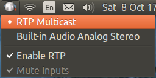

# Audio switch applet for Ubuntu

Provides an indicator that lets one switch between pulseaudio sinks, toggle RTP sink and inputs. Applet is tested on
Ubuntu 14.04 and 16.04. It uses `pactl` and `pacmd` programs to control sound settings.

## Installation

Applet can be downloaded as a Ruby gem `audio_switch`. It depends on `libappindicator-dev`.

```bash
apt-get install libappindicator-dev
gem install audio_switch
```  

## Running

```bash
audio_switch
```



## Author

Anatolii Saienko

## License  

MIT